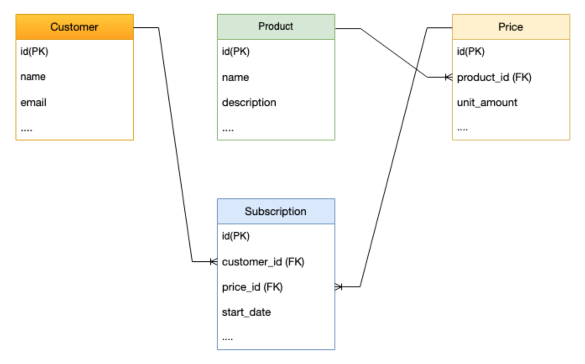

# Stripe API (Review New Version Specification)

This is a simple Stripe API server created to review the specifications of the new API version, 2024-10-28.acacia.

## Stripe Subscription Data Structure

Point: A Subscription includes a foreign key to Price, enabling support for multiple pricing plans. This allows for accurate identification of which pricing plan a specific subscription is based on. Additionally, the customer_id clearly represents which pricing plan (Price) the user has selected.

